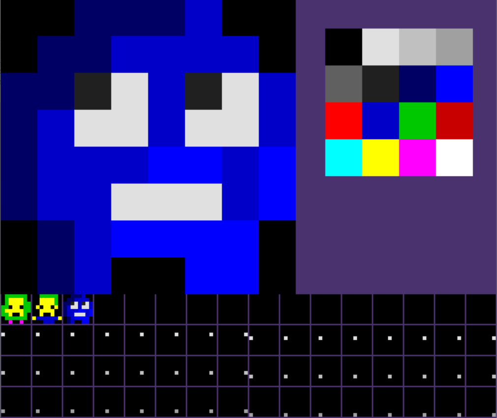

# spritely
Spritely is a sprite editor for making tiny sprites.
Spritely makes a 64 sprite sprite sheet in the format of png.  Each sprite is 8x8 pixels with 16 colors.

## Demo
A limited demo can be found here: https://dfirebaugh.github.io/spritely/



## Build Requirements

```
$ sudo apt-get install libsdl2-ttf-dev
```

## Webassembly build

Running `make web` will build spritely using emscripten. So in order to run it, you need to download it from : https://emscripten.org/docs/getting_started/downloads.html

`make web` will create two files: `index.js` and `index.wasm`. Using the given `index.html` and a simple web server (Chrome doesn't support `file://` XHR request), you can use spritely in your web browser !

(You can run a simple web server by going to the `web` folder and then run a web server using python2 with `python2 -m SimpleHTTPServer 8080` or python3 with `python -m http.server 8080`)

# Shortcuts and bindings

Here are some shortcuts/bindings:-

<kbd>Ctrl</kbd>+<kbd>C</kbd> -> Copy\
<kbd>Ctrl</kbd>+<kbd>V</kbd> -> Paste\
<kbd>Ctrl</kbd>+<kbd>Z</kbd> -> Undo\
<kbd>Ctrl</kbd>+<kbd>Shift</kbd>+<kbd>Z</kbd> OR <kbd>Ctrl</kbd>+<kbd>Y</kbd> -> Redo\
<kbd>Ctrl</kbd>+<kbd>S</kbd> -> Save the spritesheet\
<kbd>Ctrl</kbd>+<kbd>Shift</kbd>+<kbd>S</kbd> -> Save the spritesheet and images for each sprite\
<kbd>Ctrl</kbd>+<kbd>O</kbd> -> Load a spritesheet from an image file\
`Left click` -> to draw pixel\
`Right click` -> to select a colour that is on the  canvas\
`Arrow Keys` -> to move sprite selection"\
<kbd>F</kbd>-> fill tool\
<kbd>Space</kbd> -> pen tool
